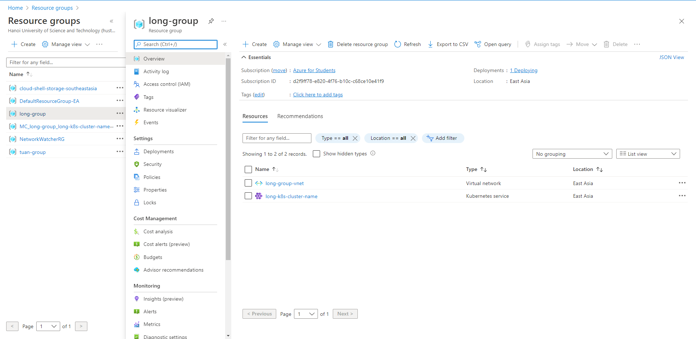

# link gitlab 

- https://gitlab.com/longpt233/deploy-customer

# tạo cụm 

- chú ý node pools để 1 thôi k tốn tiền 
- kết quả : long-group và aks group 




# kết nối cụm với gitlab ci

- ref: https://stackoverflow.com/questions/50749095/how-to-integrate-gitlab-ci-w-azure-kubernetes-kubectl-acr-for-deployments

- lấy thông tin, điền vô project> infratructure> kubenettes cluster 

```
cat .kube/config 
name: long-k8s-cluster-name
server: API URL
certificate-authority-data : CA Certificate -> dùng base64 decode cái này
token: 
```
- chú ý cái scope để điền vô env của gitlab-ci -> lấy biễn $KUBECONFIG

- kết quả 


## cách trên nỗi và cũng không dùng nữa -> phải dùng cách mới thôi 

- ref: https://docs.gitlab.com/ee/user/infrastructure/clusters/migrate_to_gitlab_agent.html

- connect to cluster. trên cụm k8s azuze chạy câu lênh này là có thể connect dc 

```
helm repo add gitlab https://charts.gitlab.io
helm repo update
helm upgrade --install gitlab-agent gitlab/gitlab-agent \
    --namespace gitlab-agent \
    --create-namespace \
    --set config.token=PRFjzNv7hHsTghKxkcDdc1yyaSWiBNuttcnhb3p1PkT_-x-ZLg \
    --set config.kasAddress=wss://kas.gitlab.com
```

- lưu ý cái tên ở đây sẽ dùng để use context ở trong code 
- kết quả


# gitlab ci 

- check context 

```
nguyen@Azure:~$ kubectl config get-contexts
CURRENT   NAME               CLUSTER            AUTHINFO                                  NAMESPACE
*         long-k8s-cluster   long-k8s-cluster   clusterUser_long-group_long-k8s-cluster
```

- check ns

```
nguyen@Azure:~$ kubectl get namespace
NAME              STATUS   AGE
default           Active   17m   # default namespac
kube-node-lease   Active   17m   # Node leases allow the kubelet to send heartbeats so that the control plane can detect node failure
kube-public       Active   17m   #  created automatically and is readable by all users
kube-system       Active   17m   # Kubernetes system
```

- check pod 

```
kubectl get all -o wide                                                           
NAME                 TYPE        CLUSTER-IP   EXTERNAL-IP   PORT(S)   AGE   SELECTOR
service/kubernetes   ClusterIP   10.0.0.1     <none>        443/TCP   23m   <none>
```

- sau khi chạy lệnh đăng kí helm 

- check ns -> có thêm gitlab-agent 

```
nguyen@Azure:~$ kubectl get namespace
NAME              STATUS   AGE
default           Active   24m
gitlab-agent      Active   106s
kube-node-lease   Active   24m
kube-public       Active   24m
kube-system       Active   24m
```

- check pod 

```
nguyen@Azure:~$ kubectl get pods --namespace=gitlab-agent
NAME                           READY   STATUS    RESTARTS   AGE
gitlab-agent-568bbbc67-74fqb   1/1     Running   0          6m23s
```

- trong file gitlab-ci cần use contex như này là coi như chạy dc 

```
<user>/<project>:<tên agent tạo trên gui>
kubectl config use-context longpt233/deploy-customer:customer-agent
```

- trên agent gitlab 

```
$ kubectl get all -o wide
NAME                                      READY   STATUS              RESTARTS   AGE   IP       NODE                                NOMINATED NODE   READINESS GATES
pod/customer-meta-name-646bfbb688-zbpmw   0/1     ContainerCreating   0          1s    <none>   aks-agentpool-16546334-vmss000000   <none>           <none>
NAME                   TYPE           CLUSTER-IP     EXTERNAL-IP   PORT(S)          AGE   SELECTOR
service/kubernetes     ClusterIP      10.0.0.1       <none>        443/TCP          33m   <none>
service/lb-meta-name   LoadBalancer   10.0.145.234   <pending>     2025:32157/TCP   1s    app=customer-labels
NAME                                 READY   UP-TO-DATE   AVAILABLE   AGE   CONTAINERS                IMAGES                                   SELECTOR
deployment.apps/customer-meta-name   0/1     1            0           2s    customer-container-name   [MASKED]/deploy-customer-image:latest   app=customer-labels
NAME                                            DESIRED   CURRENT   READY   AGE   CONTAINERS                IMAGES                                   SELECTOR
replicaset.apps/customer-meta-name-646bfbb688   1         1         0       3s    customer-container-name   [MASKED]/deploy-customer-image:latest   app=customer-labels,pod-template-hash=646bfbb688
```

- tren cụm của azuze 


```
NAME                                      READY   STATUS    RESTARTS   AGE    IP           NODE                                NOMINATED NODE   READINESS GATES
pod/customer-meta-name-646bfbb688-zbpmw   1/1     Running   0          2m6s   10.244.0.9   aks-agentpool-16546334-vmss000000   <none>           <none>

NAME                   TYPE           CLUSTER-IP     EXTERNAL-IP   PORT(S)          AGE    SELECTOR
service/kubernetes     ClusterIP      10.0.0.1       <none>        443/TCP          35m    <none>
service/lb-meta-name   LoadBalancer   10.0.145.234   20.239.8.53   2025:32157/TCP   2m5s   app=customer-labels

NAME                                 READY   UP-TO-DATE   AVAILABLE   AGE    CONTAINERS                IMAGES                                   SELECTOR
deployment.apps/customer-meta-name   1/1     1            1           2m6s   customer-container-name   longpt233/deploy-customer-image:latest   app=customer-labels

NAME                                            DESIRED   CURRENT   READY   AGE    CONTAINERS                IMAGES                                   SELECTOR
replicaset.apps/customer-meta-name-646bfbb688   1         1         1       2m6s   customer-container-name   longpt233/deploy-customer-image:latest   app=customer-labels,pod-template-hash=646bfbb688
```


